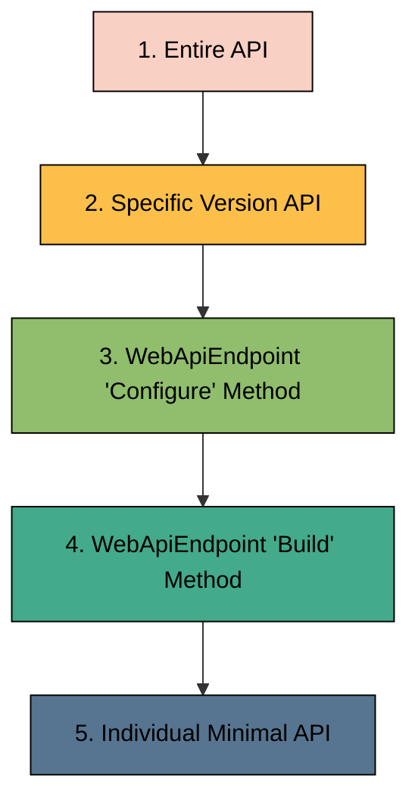

# Futurum.WebApiEndpoint.Micro


[](https://coveralls.io/github/futurum-dev/dotnet.futurum.webapiendpoint.micro?branch=main)
[](https://www.nuget.org/packages/futurum.webapiendpoint.micro)

The Futurum.WebApiEndpoint.Micro is a powerful .NET library that aids in the construction of WebApiEndpoints in a systematic manner.

It leverages the capabilities of .NET 8 and minimal APIs to facilitate the development of your Web APIs in a well-structured and defined manner. This library not only streamlines the process of Web API development but also provides the flexibility to incorporate new features without modifying any existing code. This is achieved through the implementation of a vertical slice architecture.

In the context of vertical slice architecture, each feature or functionality of the application is developed as an independent slice, from the user interface to the data storage layer. This approach enhances the modularity of the application, making it easier to add, modify, or remove features without affecting the rest of the application. The Futurum.WebApiEndpoint.Micro library embodies this architectural style, making it an excellent tool for developing robust and scalable Web APIs.

```csharp
[WebApiEndpoint("greeting")]
public partial class GreetingWebApiEndpoint
{
    protected override void Build(IEndpointRouteBuilder builder)
    {
        builder.MapGet("/hello", HelloHandler);
        builder.MapGet("/goodbye", GoodbyeHandler);
    }

    private static Ok<string> HelloHandler(HttpContext context, string name) =>
        $"Hello {name}".ToOk();

    private static Ok<string> GoodbyeHandler(HttpContext context, string name) =>
        $"Goodbye {name}".ToOk();
}
```

## Key Features
- ✅ Structured way of building WebApiEndpoints using [minimal apis](https://learn.microsoft.com/en-us/aspnet/core/fundamentals/minimal-apis?view=aspnetcore-7.0)
- ✅ [Easy setup](#easy-setup)
- ✅ Full support and built on top of [minimal apis](https://learn.microsoft.com/en-us/aspnet/core/fundamentals/minimal-apis?view=aspnetcore-7.0)
- ✅ Full support for OpenApi
- ✅ Full support for Api Versioning
- ✅ Full support for [TypedResults](https://learn.microsoft.com/en-us/dotnet/api/microsoft.aspnetcore.http.typedresults?view=aspnetcore-7.0)
- ✅ Support for configuring
  - ✅ [Futurum.WebApiEndpoint.Micro](#configuring-futurumwebapiendpointmicro)
  - ✅ [entire API](#1-configuring-the-entire-api)
  - ✅ [specific API version](#2-configuring-a-specific-api-version)
  - ✅ [individual WebApiEndpoint(s)](#how-to-create-a-webapiendpoint)
  - ✅ individual REST method(s) - as per standard minimal apis
- ✅ [Supports uploading file(s) with additional JSON payload](#uploading-files-with-additional-json-payload)
- ✅ Built in [sandbox runner](#sandbox-runner) with full [TypedResults support](https://learn.microsoft.com/en-us/dotnet/api/microsoft.aspnetcore.http.typedresults?view=aspnetcore-7.0), catching unhandled exceptions and returning a [ProblemDetails](https://learn.microsoft.com/en-us/dotnet/api/microsoft.aspnetcore.mvc.problemdetails?view=aspnetcore-7.0) response
- ✅ Autodiscovery of WebApiEndpoint(s), based on Source Generators
- ✅ [Roslyn Analysers](#roslyn-analysers) to help build your WebApiEndpoint(s) and ensure best practices
- ✅ Enables Vertical Slice Architecture, giving you the ability to add new features without changing existing code
- ✅ Built on dotnet 8
- ✅ Built in use of [ProblemDetails](https://learn.microsoft.com/en-us/dotnet/api/microsoft.aspnetcore.mvc.problemdetails?view=aspnetcore-7.0) support
- ✅ Built in [extendable GlobalExceptionHandler](#extendable-globalexceptionhandler)
- ✅ Developer friendly, with a simple API and with a full suite of samples and tests
- ✅ [Tested solution](https://coveralls.io/github/futurum-dev/dotnet.futurum.webapiendpoint.micro)
- ✅ [Comprehensive samples](#comprehensive-samples)
- ✅ [Convention Customisation](#convention-customisation)

## Table of Contents
1. [What is a WebApiEndpoint?](#what-is-a-webapiendpoint)
2. [Easy setup](#easy-setup)
3. [Configuration](#configuration)
4. [Sandbox runner](#sandbox-runner)
5. [Uploading file(s) with additional JSON payload](#uploading-files-with-additional-json-payload)
6. [Additional helper functions](#additional-helper-functions)
7. [Comprehensive samples](#comprehensive-samples)
8. [Convention Customisation](#convention-customisation)
9. [Extendable GlobalExceptionHandler](#extendable-globalexceptionhandler)
10. [Tips & Tricks](#tips--tricks)
11. [Troubleshooting](#troubleshooting)
12. [Roslyn Analysers](#roslyn-analysers)

## What is a WebApiEndpoint?
- It represents a vertical slice or a distinct feature of your application.
- Each vertical slice is a self-contained functional unit.
- It's a collection of Web APIs that share a common route prefix and version. They can also share various aspects such as Security, EndpointFilters, RateLimiting, OutputCaching, and more.

## Easy setup
Check out this section for a step-by-step guide to setting up the library for use in your development environment.

- ✅ Add the [NuGet package](https://www.nuget.org/packages/futurum.webapiendpoint.micro) ( futurum.webapiendpoint.micro ) to your project
- ✅ Update *program.cs* as per [here](#example-programcs)

### Example program.cs
Here's an example of how to update your *program.cs* file:

```csharp
using Futurum.WebApiEndpoint.Micro;
using Futurum.WebApiEndpoint.Micro.Sample;

var builder = WebApplication.CreateBuilder(args);

builder.Services
       .AddWebApiEndpoints(new WebApiEndpointConfiguration(WebApiEndpointVersions.V1_0))
       .AddWebApiEndpointsForFuturumWebApiEndpointMicroSample();

var app = builder.Build();

app.UseWebApiEndpoints();

if (app.Environment.IsDevelopment())
{
    app.UseWebApiEndpointsOpenApi();
}

app.Run();
```
**See *[program.cs](https://github.com/futurum-dev/dotnet.futurum.webapiendpoint.micro/blob/main/sample/Futurum.WebApiEndpoint.Micro.Sample/Program.cs)* in sample project**

#### AddWebApiEndpointsFor... (per project containing WebApiEndpoints)
This will be automatically created by the source generator.

You need to call this for each project that contains WebApiEndpoints, in order for them to be added to the pipeline.

e.g.
```csharp
builder.Services.AddWebApiEndpointsForFuturumWebApiEndpointMicroSample();
```

#### UseWebApiEndpoints
Adds the WebApiEndpoints to the pipeline and does various other setup needed for the WebApiEndpoints to work.
```csharp
app.UseWebApiEndpoints();
```

#### UseWebApiEndpointsOpenApi
Register the OpenApi UI (Swagger and SwaggerUI) middleware. This is usually only done in development mode.
```csharp
app.UseWebApiEndpointsOpenApi();
```

### How to create a WebApiEndpoint
1. Create a new partial class.
2. Add the *WebApiEndpoint* attribute to the class, with the *route prefix* for all the REST methods in this WebApiEndpoint. You can also optionally add a *tag*. This is used in the OpenApi documentation. If you do not specify a tag, then the route prefix is used.
3. Add the *WebApiEndpointVersion* attribute to the class, if you want to specify a specific *ApiVersion*. If you do not specify a specific *ApiVersion*, then the default *ApiVersion* is used. You can add multiple *WebApiEndpointVersion* attributes to the class, if you want to support multiple *ApiVersions*.
4. Implement the *Build* method and add *minimal api(s)* as per usual.
5. *Optionally* implement the *Configure* method to configuration the *WebApiEndpoint*

#### Build
You can *map* your minimal apis for this WebApiEndpoint in the *Build* method.

The *IEndpointRouteBuilder* that the *Build* method receives has already:
- been configured with [configuring for the entire API](#1-configuring-the-entire-api)
- been configured with the API versioning
- been configured with [configuring a specific API version](#2-configuring-a-specific-api-version)
- been configured with the route prefix and tag
- been through the *optional* *[Configure](#configure)* method in the same class

```csharp
protected override void Build(IEndpointRouteBuilder builder)
{
}
```

##### Full example
```csharp
[WebApiEndpoint("weather")]
public partial class WeatherWebApiEndpoint
{
    private static readonly string[] Summaries =
    {
        "Freezing", "Bracing", "Chilly", "Cool", "Mild", "Warm", "Balmy", "Hot", "Sweltering", "Scorching"
    };

    protected override void Build(IEndpointRouteBuilder builder)
    {
        builder.MapGet("/", GetHandler);
    }

    private static Ok<IEnumerable<WeatherForecastDto>> GetHandler(HttpContext httpContext, CancellationToken cancellationToken) =>
        Enumerable.Range(1, 5)
                  .Select(index => new WeatherForecastDto(DateOnly.FromDateTime(DateTime.Now.AddDays(index)), Random.Shared.Next(-20, 55), Summaries[Random.Shared.Next(Summaries.Length)]))
                  .ToOk();
}
```
**See *[WeatherWebApiEndpoint](https://github.com/futurum-dev/dotnet.futurum.webapiendpoint.micro/blob/main/sample/Futurum.WebApiEndpoint.Micro.Sample/WeatherForecast/WeatherWebApiEndpoint.cs)* in sample project**

#### Configure
You can *optionally* configure the WebApiEndpoint in the *Configure* method.

```csharp
protected override RouteGroupBuilder Configure(RouteGroupBuilder groupBuilder, WebApiEndpointVersion webApiEndpointVersion)
{
}
```

This allows you to setup the RouteGroupBuilder. This will effect all minimal apis in this classes *Build* method.

You can also configure it differently per ApiVersion.

#### This ia a good place to add a WebApiEndpoint specific *EndpointFilter*
```csharp
groupBuilder.AddEndpointFilter<CustomEndpointFilter>();
```
**See *[EndpointFilterWebApiEndpoint](https://github.com/futurum-dev/dotnet.futurum.webapiendpoint.micro/blob/main/sample/Futurum.WebApiEndpoint.Micro.Sample/Features/EndpointFilterWebApiEndpoint.cs)* in sample project**

#### This ia a good place to add a WebApiEndpoint specific *RateLimiting*
```csharp
groupBuilder.RequireRateLimiting(RateLimiting.SlidingWindow.Policy);
```
**See *[RateLimitingWebApiEndpoint](https://github.com/futurum-dev/dotnet.futurum.webapiendpoint.micro/blob/main/sample/Futurum.WebApiEndpoint.Micro.Sample/Features/RateLimitingWebApiEndpoint.cs)* in sample project**

#### This ia a good place to add a WebApiEndpoint specific *OutputCache* 
```csharp
groupBuilder.CacheOutput(OutputCaching.ExpiryIn10Seconds.Policy);
```
**See *[OutputCachingWebApiEndpoint](https://github.com/futurum-dev/dotnet.futurum.webapiendpoint.micro/blob/main/sample/Futurum.WebApiEndpoint.Micro.Sample/Features/OutputCachingWebApiEndpoint.cs)* in sample project**

#### This ia a good place to add WebApiEndpoint specific *Security*
```csharp
groupBuilder.RequireAuthorization(Authorization.Permission.Admin);
```
**See *[SecurityProtectedWebApiEndpoint](https://github.com/futurum-dev/dotnet.futurum.webapiendpoint.micro/blob/main/sample/Futurum.WebApiEndpoint.Micro.Sample/Security/SecurityProtectedWebApiEndpoint.cs)* in sample project**

## Configuration
This section details how to configure Futurum.WebApiEndpoint.Micro to make the most out of its features for specific use cases. Apart from configuring the entire API, it will also show you how to configure a specific API version, and individual WebApiEndpoint(s).

### Configuring Futurum.WebApiEndpoint.Micro
This allows you to configure:
- DefaultApiVersion *(mandatory)*
  - This is used if a ApiVersion is not provided for a specific WebApiEndpoint.
- OpenApi
  - DefaultInfo *(optional)*
    - This is used if a OpenApiInfo is not provided for a specific ApiVersion
  - VersionedInfo *(optional)*
    - Allowing you to have an OpenApiInfo per a specific ApiVersion. If you do not provide an OpenApiInfo for a specific ApiVersion, then the DefaultInfo is used.
- Version
  - Prefix *(optional)*
  - Format *(optional)*
    - uses 'Asp.Versioning.ApiVersionFormatProvider'

#### Example in *program.cs*
```csharp
builder.Services
       .AddWebApiEndpoints(new WebApiEndpointConfiguration(WebApiEndpointVersions.V1_0.Version)
       {
           OpenApi =
           {
               DefaultInfo =
               {
                   Title = "Futurum.WebApiEndpoint.Micro.Sample",
               },
               VersionedInfo =
               {
                   {
                       WebApiEndpointVersions.V3_0.Version,
                       new OpenApiInfo
                       {
                           Title = "Futurum.WebApiEndpoint.Micro.Sample v3"
                       }
                   }
               }
           }
       });
```
**See *[program.cs](https://github.com/futurum-dev/dotnet.futurum.webapiendpoint.micro/blob/main/sample/Futurum.WebApiEndpoint.Micro.Sample/Program.cs)* in sample project**

The configuration is applied in the following order:


### 1. Configuring the entire API
The entire API can be configured to set global parameters. This is an ideal place to set configurations such as:  
- Global route prefix: This is a common prefix for all routes in your API.
- Global authorization: This is where you can set the authorization required for all endpoints in your API. Remember to use the AllowAnonymous attribute on individual WebApiEndpoints that should not be secured, such as a Login endpoint.

To configure the entire API, you need to create a class that implements the IGlobalWebApiEndpoint interface.

**Note: There can only be one class that implements IGlobalWebApiEndpoint. This is enforced by an analyzer.**

**Note: The configuration set in this class is applied before the version route is created.**

Here is an example of how to implement this:

#### Example
```csharp
public class GlobalWebApiEndpoint : IGlobalWebApiEndpoint
{
    public IEndpointRouteBuilder Configure(IEndpointRouteBuilder builder, WebApiEndpointConfiguration configuration)
    {
        // Set the global route prefix to "api" and require admin authorization for all endpoints
        return builder.MapGroup("api").RequireAuthorization(Authorization.Permission.Admin);
    }
}
```
**See *[GlobalWebApiEndpoint](https://github.com/futurum-dev/dotnet.futurum.webapiendpoint.micro/blob/main/sample/Futurum.WebApiEndpoint.Micro.Sample/GlobalWebApiEndpoint.cs)* in sample project**

### 2. Configuring a specific API version
In the context of API development, it's often necessary to configure specific API versions. This configuration can include aspects such as:  
- Authorization specific to the API version: This is where you can set the authorization required for all endpoints in a specific API version. Don't forget to use the AllowAnonymous attribute on individual WebApiEndpoints that should not be secured, such as a Login endpoint.

To configure a specific API version, you need to create a class that:  
- Implements the IWebApiVersionEndpoint interface.
- Is decorated with at least one WebApiVersionEndpointVersion attribute, indicating the version(s) it applies to.

**Note: There can only be one class that configures a specific API version. This is enforced by a Roslyn analyzer.**

**Note: The configuration set in this class is applied after the version route is created, but before the specific WebApiEndpoint route is created.**

Here's an example of how to implement this:

#### Example
```csharp
[WebApiVersionEndpointVersion(WebApiEndpointVersions.V3_0.Number)]
[WebApiVersionEndpointVersion(WebApiEndpointVersions.V1_20_Beta.Text)]
public class WebApiVersionEndpoint3_0a : IWebApiVersionEndpoint
{
    public RouteGroupBuilder Configure(IEndpointRouteBuilder builder, WebApiEndpointConfiguration configuration)
    {
        // Set the route group to "test-api" and require admin authorization for all endpoints
        return builder.MapGroup("test-api").RequireAuthorization(Authorization.Permission.Admin);
    }
}
```
**See *[WebApiVersionEndpoint3_0a](https://github.com/futurum-dev/dotnet.futurum.webapiendpoint.micro/blob/main/sample/Futurum.WebApiEndpoint.Micro.Sample/WebApiVersionEndpoint3_0.cs)* in sample project**

**Remember, the configuration of specific API versions is a crucial aspect of maintaining and managing your APIs, especially when dealing with different versions of the same API. It allows you to control the behavior of each version independently, providing flexibility and control over your API's functionality.**

### 3. WebApiEndpoint 'Configure' Method
See [here](#configure)

### 4. WebApiEndpoint 'Build' Method
See [here](#build).

### 5. Individual Minimal API
See [here](https://learn.microsoft.com/en-us/aspnet/core/fundamentals/minimal-apis/overview?view=aspnetcore-8.0).

## Sandbox runner
The Sandbox Runner is a feature that provides a set of comprehensive extension methods to execute your code in a controlled environment or "sandbox".

### Run and RunAsync - Handling code that returns an *IResult*
These extension methods are designed to handle code that returns an IResult. The behavior of these methods is as follows:  
- If your code executes without throwing an unhandled exception, the original return value remains unchanged.
- If your code throws an unhandled exception, a BadRequest&lt;ProblemDetails&gt; is returned, containing relevant details about the exception.

The returned Results<...> type is always expanded to include BadRequest&lt;ProblemDetails&gt;.

```csharp
TIResult1 -> Results<TIResult1, BadRequest<ProblemDetails>>

Results<TIResult1, TIResult2> -> Results<TIResult1, TIResult2, BadRequest<ProblemDetails>>

Results<TIResult1, TIResult2, TIResult3> -> Results<TIResult1, TIResult2, TIResult3, BadRequest<ProblemDetails>>

Results<TIResult1, TIResult2, TIResult3, TIResult4> -> Results<TIResult1, TIResult2, TIResult3, TIResult4, BadRequest<ProblemDetails>>

Results<TIResult1, TIResult2, TIResult3, TIResult4, TIResult5> -> Results<TIResult1, TIResult2, TIResult3, TIResult4, TIResult5, BadRequest<ProblemDetails>>
```

The Results type can accommodate a maximum of 6 types. Therefore, up to 5 types are allowed, reserving one space for BadRequest&lt;ProblemDetails&gt;.

#### Example use
```csharp
private static Results<NotFound, FileStreamHttpResult, BadRequest<ProblemDetails>> DownloadHandler(HttpContext context)
{
    return Run(Execute, context, "Failed to read file");

    Results<NotFound, FileStreamHttpResult> Execute()
    {
        var path = "./Data/hello-world.txt";

        if (!File.Exists(path))
        {
            return TypedResults.NotFound();
        }

        var fileStream = File.OpenRead(path);
        return TypedResults.File(fileStream, MediaTypeNames.Application.Octet, "hello-world.txt");
    }
}
```

In this example the *Execute* method is wrapped by the runner. It returns:
- a *NotFound* if the file does not exist
- a *FileStreamHttpResult* if the file exists

```csharp
Results<NotFound, FileStreamHttpResult>
```

The *Run* / *RunAsync* extension method modifies this to include *BadRequest&lt;ProblemDetails&gt;*.

```csharp
Results<NotFound, FileStreamHttpResult, BadRequest<ProblemDetails>>
```

**Note:** It is recommended to add the following to your *GlobalUsings.cs* file.
```csharp
global using static Futurum.WebApiEndpoint.Micro.WebApiEndpointRunner;
```

This allows you to use the helper functions without having to specify the namespace, as demonstrated in the examples.

### RunToOk and RunToOkAsync - If your code returns *void* or  *T* (not a *IResult*)
These extension methods are designed to handle code that returns *void* or *T*. The behavior of these methods is as follows:
- If your code executes without throwing an unhandled exception, the original return value remains unchanged.
- If your code throws an unhandled exception, a BadRequest&lt;ProblemDetails&gt; is returned, containing relevant details about the exception.

The returned Results<...> type is always expanded to include BadRequest&lt;ProblemDetails&gt;.

```csharp
void -> Results<Ok, BadRequest<ProblemDetails>>

T -> Results<Ok<T>, BadRequest<ProblemDetails>>
```

#### Example use
```csharp
private static Results<Ok<IAsyncEnumerable<Todo>>, BadRequest<ProblemDetails>> GetAllHandler(HttpContext context, SqliteConnection db)
{
    return RunToOk(Execute, context, "Failed to get todos");

    IAsyncEnumerable<Todo> Execute() =>
        db.QueryAsync<Todo>("SELECT * FROM Todos");
}
```

In this example the *Execute* method returns *IAsyncEnumerable&lt;Todo&gt;*

```csharp
IAsyncEnumerable<Todo>
```

The *RunToOk* / *RunToOkAsync* extension method will
- change the *T* to *Ok&lt;T&gt;*
- add *BadRequest&lt;ProblemDetails&gt;*.

```csharp
Results<Ok<IAsyncEnumerable<Todo>>, BadRequest<ProblemDetails>>
```

**Note:** It is recommended to add the following to your *GlobalUsings.cs* file.
```csharp
global using static Futurum.WebApiEndpoint.Micro.WebApiEndpointRunner;
```

This allows you to use the helper functions without having to specify the namespace, as demonstrated in the examples.

## Uploading file(s) with additional JSON payload
This section guides you on how to upload files with additional JSON payload using Futurum.WebApiEndpoint.Micro.

### Upload single file and payload
Use the *FormFileWithPayload* type to upload a single file and a JSON payload

```csharp
private static Task<Results<Ok<FileDetailsWithPayloadDto>, BadRequest<ProblemDetails>>> UploadWithPayloadHandler(HttpContext context, FormFileWithPayload<PayloadDto> fileWithPayload)
{
    return RunAsync(Execute, context, ToOk, "Failed to read file");

    async Task<FileDetailsWithPayloadDto> Execute()
    {
        var tempFile = Path.GetTempFileName();
        await using var stream = File.OpenWrite(tempFile);
        await fileWithPayload.File.CopyToAsync(stream);

        return new FileDetailsWithPayloadDto(fileWithPayload.File.FileName, fileWithPayload.Payload.Name);
    }
}
```

### Upload multiple files and payload
Use the *FormFilesWithPayload* type to upload multiple files and a JSON payload

```csharp
private static Task<Results<Ok<IEnumerable<FileDetailsWithPayloadDto>>, BadRequest<ProblemDetails>>> UploadsWithPayloadHandler(
    HttpContext context, FormFilesWithPayload<PayloadDto> filesWithPayload)
{
    return RunAsync(Execute, context, ToOk, "Failed to read file");

    async Task<IEnumerable<FileDetailsWithPayloadDto>> Execute()
    {
        var fileDetails = new List<FileDetailsWithPayloadDto>();

        foreach (var file in filesWithPayload.Files)
        {
            var tempFile = Path.GetTempFileName();
            await using var stream = File.OpenWrite(tempFile);
            await file.CopyToAsync(stream);

            fileDetails.Add(new FileDetailsWithPayloadDto(file.FileName, filesWithPayload.Payload.Name));
        }

        return fileDetails;
    }
}
```

## Additional helper functions
The final section provides a detailed overview of the additional helper functions that aid in program development.

### ToOk
Converts a *T* to an *Ok&lt;T&gt;*.

```csharp
ToOk
```

### ToCreated
Converts a *()* to a *Created*.

```csharp
ToCreated<string>
```

By default it will take the location from the *HttpContext.Request.Path*.

or

Converts a *T* to a *Created&lt;T&gt;*.

This can be overridden by passing in a *string*.

```csharp
ToCreated<T>("/api/articles")
```

### ToAccepted
Converts a *()* to a *Accepted*.

```csharp
ToAccepted<string>
```

By default it will take the location from the *HttpContext.Request.Path*.

or

Converts a *T* to a *Accepted&lt;T&gt;*.

By default it will take the location from the *HttpContext.Request.Path*.

This can be overridden by passing in a *string*.

```csharp
ToAccepted<T>("/api/articles")
```

## Comprehensive samples
There are examples showing the following:
- ✅ A basic blog CRUD implementation - [link](https://github.com/futurum-dev/dotnet.futurum.webapiendpoint.micro/blob/main/sample/Futurum.WebApiEndpoint.Micro.Sample/Blog/BlogWebApiEndpoint.cs)
- ✅ The *ToDo* sample from Damian Edwards [here](https://github.com/DamianEdwards/TrimmedTodo) - [link](https://github.com/futurum-dev/dotnet.futurum.webapiendpoint.micro/blob/main/sample/Futurum.WebApiEndpoint.Micro.Sample/Todo/TodoApiWebApiEndpoint.cs)
- ✅ AsyncEnumerable - [link](https://github.com/futurum-dev/dotnet.futurum.webapiendpoint.micro/blob/main/sample/Futurum.WebApiEndpoint.Micro.Sample/Features/AsyncEnumerableWebApiEndpoint.cs)
- ✅ Bytes file download - [link](https://github.com/futurum-dev/dotnet.futurum.webapiendpoint.micro/blob/main/sample/Futurum.WebApiEndpoint.Micro.Sample/Features/BytesWebApiEndpoint.cs)
- ✅ EndpointFilter on a specific WebApiEndpoint - [link](https://github.com/futurum-dev/dotnet.futurum.webapiendpoint.micro/blob/main/sample/Futurum.WebApiEndpoint.Micro.Sample/Features/EndpointFilterWebApiEndpoint.cs)
- ✅ Exception handling - [link](https://github.com/futurum-dev/dotnet.futurum.webapiendpoint.micro/blob/main/sample/Futurum.WebApiEndpoint.Micro.Sample/Features/ErrorWebApiEndpoint.cs)
- ✅ File(s) upload - [link](https://github.com/futurum-dev/dotnet.futurum.webapiendpoint.micro/blob/main/sample/Futurum.WebApiEndpoint.Micro.Sample/Features/FileWebApiEndpoint.cs)
- ✅ File(s) upload with Payload - [link](https://github.com/futurum-dev/dotnet.futurum.webapiendpoint.micro/blob/main/sample/Futurum.WebApiEndpoint.Micro.Sample/Features/FileWebApiEndpoint.cs)
- ✅ File download - [link](https://github.com/futurum-dev/dotnet.futurum.webapiendpoint.micro/blob/main/sample/Futurum.WebApiEndpoint.Micro.Sample/Features/FileWebApiEndpoint.cs)
- ✅ OpenApi versioning - [link v0](https://github.com/futurum-dev/dotnet.futurum.webapiendpoint.micro/blob/main/sample/Futurum.WebApiEndpoint.Micro.Sample/OpenApi/OpenApiVersionV0WebApiEndpoint.cs), [link v1, v1.20-beta, v3, v4-alpha](https://github.com/futurum-dev/dotnet.futurum.webapiendpoint.micro/blob/main/sample/Futurum.WebApiEndpoint.Micro.Sample/OpenApi/OpenApiVersionV1WebApiEndpoint.cs), [link v2](https://github.com/futurum-dev/dotnet.futurum.webapiendpoint.micro/blob/main/sample/Futurum.WebApiEndpoint.Micro.Sample/OpenApi/OpenApiVersionV2WebApiEndpoint.cs)
- ✅ Output Caching - [link](https://github.com/futurum-dev/dotnet.futurum.webapiendpoint.micro/blob/main/sample/Futurum.WebApiEndpoint.Micro.Sample/Features/OutputCachingWebApiEndpoint.cs)
- ✅ Rate Limiting - [link](https://github.com/futurum-dev/dotnet.futurum.webapiendpoint.micro/blob/main/sample/Futurum.WebApiEndpoint.Micro.Sample/Features/RateLimitingWebApiEndpoint.cs)
- ✅ [Security](#security-example) with a basic JWT example on a specific WebApiEndpoint - [login link](https://github.com/futurum-dev/dotnet.futurum.webapiendpoint.micro/blob/main/sample/Futurum.WebApiEndpoint.Micro.Sample/Security/SecurityLoginWebApiEndpoint.cs), [protected link](https://github.com/futurum-dev/dotnet.futurum.webapiendpoint.micro/blob/main/sample/Futurum.WebApiEndpoint.Micro.Sample/Security/SecurityProtectedWebApiEndpoint.cs)
- ✅ Weather Forecast - [link](https://github.com/futurum-dev/dotnet.futurum.webapiendpoint.micro/blob/main/sample/Futurum.WebApiEndpoint.Micro.Sample/WeatherForecast/WeatherWebApiEndpoint.cs)
- ✅ Addition project containing WebApiEndpoints - [link](https://github.com/futurum-dev/dotnet.futurum.webapiendpoint.micro/blob/main/sample/Futurum.WebApiEndpoint.Micro.Sample.Addition/AdditionWebApiEndpoint.cs)
- ✅ Configuring setting for entire API - [link](https://github.com/futurum-dev/dotnet.futurum.webapiendpoint.micro/blob/main/sample/Futurum.WebApiEndpoint.Micro.Sample/GlobalWebApiEndpoint.cs)
- ✅ Configuring setting for specific API version - [link v3, v1.20-beta](https://github.com/futurum-dev/dotnet.futurum.webapiendpoint.micro/blob/main/sample/Futurum.WebApiEndpoint.Micro.Sample/WebApiVersionEndpoint3_0.cs)


### Security example
How to use in Swagger UI:
1. Run the Sample project
2. In the Swagger UI, go to the 'Security' 'Login' endpoint
3. Set the following
   - Username = user1 
   - Password = password1 
   - SetPermissions = true 
   - SetClaim = true 
   - SetRole = true
4. Copy the value returned without double quotes.
5. Go to the 'Security' 'Protected' endpoint
6. Click on the padlock
7. In the value textbox, enter "Bearer " (don't forget the space at the end) + the value returned from the 'Login' endpoint that you copied in step 4.
8. Click "Authorize"
9. Run the 'Protected' endpoint

## Convention Customisation
Although the default conventions are good enough for most cases, you can customise them.

### IWebApiOpenApiVersionConfigurationService
This is used to get the *OpenApiInfo* for each *WebApiEndpointVersion*.

```csharp
serviceCollection.AddWebApiEndpointOpenApiVersionConfigurationService<WebApiOpenApiVersionConfigurationService>();
```

### IWebApiOpenApiVersionUIConfigurationService
This is used to configure the *OpenApi JSON endpoint* for each *WebApiEndpointVersion*.

```csharp
serviceCollection.AddWebApiEndpointOpenApiVersionUIConfigurationService<WebApiOpenApiVersionUIConfigurationService>();
```

### IWebApiVersionConfigurationService
This is used to configure *ApiVersioning* and *ApiExplorer*.

There is an overload of *AddWebApiEndpoints* that takes a generic type of *IWebApiVersionConfigurationService*.
```csharp
builder.Services.AddWebApiEndpoints<CustomWebApiVersionConfigurationService>();
```

Use this instead
```csharp
builder.Services.AddWebApiEndpoints();
```

## Extendable GlobalExceptionHandler
Built in support for handling unhandled exceptions, returning a *ProblemDetails* response.

You can extend the *GlobalExceptionHandler* by adding your own custom exception handling and overriding the default exception handler.

**NOTE: ExceptionToProblemDetailsMapperService is not thread-safe for either:**
- **adding custom exception to ProblemDetails mapping**
- **overriding default exception to ProblemDetails mapping**

**It is recommended to do this in the *program.cs* file.**

### Add to *program.cs*
```csharp
var builder = WebApplication.CreateBuilder(args);

builder.Services.AddExceptionHandler<GlobalExceptionHandler>();

...
    
var app = builder.Build();

app.UseExceptionHandler();
```
**See *[program.cs](https://github.com/futurum-dev/dotnet.futurum.webapiendpoint.micro/blob/main/sample/Futurum.WebApiEndpoint.Micro.Sample/Program.cs)* in sample project**

### Add custom Exception to ProblemDetails mapping
In *program.cs* add the following:

```csharp
ExceptionToProblemDetailsMapperService.Add<CustomException>((exception, httpContext, errorMessage) => new()
{
    Detail = "An custom error occurred.",
    Instance = httpContext.Request.Path,
    Status = StatusCodes.Status500InternalServerError,
    Title = ReasonPhrases.GetReasonPhrase(StatusCodes.Status500InternalServerError)
});
```

### Override the Default Exception to ProblemDetails mapping
In *program.cs* add the following:

```csharp
ExceptionToProblemDetailsMapperService.OverrideDefault((exception, httpContext, errorMessage) => new()
{
    Detail = "An error occurred.",
    Instance = httpContext.Request.Path,
    Status = StatusCodes.Status500InternalServerError,
    Title = ReasonPhrases.GetReasonPhrase(StatusCodes.Status500InternalServerError)
});
```

## Tips & Tricks
### How to organise your Api Versions
You want to avoid duplicating the Api Versions in multiple places. So it's recommended to create a class that contains all the Api Versions.

```csharp
public static class WebApiEndpointVersions
{
    public static class V1_0
    {
        public const double Number = 1.0d;
        public static readonly WebApiEndpointVersion Version = WebApiEndpointVersion.Create(Number);
    }
    
    public static class V4_0_Alpha
    {
        public const double Number = 4.0d;
        public const string Status = "alpha";
        public static readonly WebApiEndpointVersion Version = WebApiEndpointVersion.Create(Number, Status);
    }

    public static class V1_20_Beta
    {
        public const string Text = "1.20-beta";
        public static readonly WebApiEndpointVersion Version = WebApiEndpointVersion.Create(Text);
    }
}
```
**See *[WebApiEndpointVersions](https://github.com/futurum-dev/dotnet.futurum.webapiendpoint.micro/blob/main/sample/Futurum.WebApiEndpoint.Micro.Sample/WebApiEndpointVersions.cs)* in sample project**

You can use this in your *program.cs* file like this.

```csharp
builder.Services.AddWebApiEndpoints(new WebApiEndpointConfiguration(WebApiEndpointVersions.V1_0.Version)
```
**See *[program.cs](https://github.com/futurum-dev/dotnet.futurum.webapiendpoint.micro/blob/main/sample/Futurum.WebApiEndpoint.Micro.Sample/Program.cs)* in sample project**

You can use this in your WebApiEndpoint like this.

```csharp
[WebApiEndpoint("openapi")]
[WebApiEndpointVersion(WebApiEndpointVersions.V1_0.Number)]
public partial class OpenApiVersionV1WebApiEndpoint
{
    ...
}
```
**See *[OpenApiVersionV1WebApiEndpoint.cs](https://github.com/futurum-dev/dotnet.futurum.webapiendpoint.micro/blob/main/sample/Futurum.WebApiEndpoint.Micro.Sample/OpenApi/OpenApiVersionV1WebApiEndpoint.cs)* in sample project**

## Troubleshooting
### No operations defined in spec!
If you see this error in the SwaggerUI - *No operations defined in spec!* - then it means you haven't added any WebApiEndpoint projects. You need to do this for each project, including the project that contains the *program.cs* file. See [this](#addwebapiendpointsfor-per-project-containing-webapiendpoints) section for more details.

### If there are Rest Api's that are not being picked up
If there are Rest Api's that are not being picked up, then it means you haven't added a WebApiEndpoint projects. You need to do this for each project, including the project that contains the *program.cs* file. See [this](#addwebapiendpointsfor-per-project-containing-webapiendpoints) section for more details.

## Roslyn Analysers
- FWAEM0001 - Non empty constructor found on WebApiEndpoint
- FWAEM0002 - BadRequest without 'ProblemDetails' use found on WebApiEndpoint
- FWAEM0003 - Multiple instances found of GlobalWebApiEndpoint
- FWAEM0004 - Multiple instances found of WebApiVersionEndpoint for the same version
