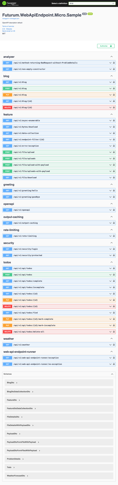

# Futurum.WebApiEndpoint.Micro


[](https://coveralls.io/github/futurum-dev/dotnet.futurum.webapiendpoint.micro?branch=main)
[](https://www.nuget.org/packages/futurum.webapiendpoint.micro)

A dotnet library that allows you to build WebApiEndpoints using a vertical slice architecture approach. Built on dotnet 7 and minimal apis.

- [x] Vertical Slice Architecture, gives you the ability to add new features without changing existing code
- [x] [Easy setup](#easy-setup)
- [x] Full support and built on top of [minimal apis](https://learn.microsoft.com/en-us/aspnet/core/fundamentals/minimal-apis?view=aspnetcore-7.0)
- [x] Full support for OpenApi
- [x] Full support for [TypedResults](https://learn.microsoft.com/en-us/dotnet/api/microsoft.aspnetcore.http.typedresults?view=aspnetcore-7.0)
- [x] [Full compatibility](#full-compatibility-with-futurumcore) with [Futurum.Core](https://www.nuget.org/packages/Futurum.Core)
- [x] [Supports uploading file(s) with additional JSON payload](#uploading-file--s--with-additional-json-payload)
- [x] Api Versioning baked-in
- [x] [Built in Validation support](#validation)
  - [x] [Integrated FluentValidation](#fluentvalidationservice)
  - [x] [Integrated DataAnnotations](#dataannotationsvalidationservice)
- [x] Built on dotnet 7
- [x] Built in use of [ProblemDetails](https://learn.microsoft.com/en-us/dotnet/api/microsoft.aspnetcore.mvc.problemdetails?view=aspnetcore-7.0) support
- [x] [Tested solution](https://coveralls.io/github/futurum-dev/dotnet.futurum.webapiendpoint.micro)
- [x] [Comprehensive samples](#comprehensive-samples)
- [x] [Convention Customisation](#convention-customisation)
- [x] Autodiscovery of WebApiEndpoint, based on Source Generators

## What is a WebApiEndpoint?
- It's a vertical slice / feature of your application
- The vertical slice is a self-contained unit of functionality
- Collection of WebApis that share a route prefix and version

## Easy setup
- [x] Add the [NuGet package](https://www.nuget.org/packages/futurum.webapiendpoint.micro) ( futurum.webapiendpoint.micro ) to your project
- [x] Update *program.cs* as per [here](#programcs)
- [x] Create a new class that implements *IWebApiEndpoint*
- [x] Add the *WebApiEndpoint* attribute to the class, if you want to specify a specific *route prefix* and *tag*
- [x] Add the *WebApiEndpointVersion* attribute to the class, if you want to specify a specific *ApiVersion*
- [x] Implement the *Register* and add *minimal api(s)* as per usual

### program.cs
#### AddWebApiEndpoints
Allows you to configure:
- DefaultApiVersion *(mandatory)*
  - This is used if a specific ApiVersion is not provided for a specific WebApiEndpoint
- DefaultOpenApiInfo *(optional)*
  - This is used if a specific OpenApiInfo is not provided for a specific ApiVersion
- OpenApiDocumentVersions *(optional)*
  - Allowing you to have different OpenApiInfo per ApiVersion
- VersionPrefix *(optional)*
- VersionFormat *(optional)*
  - uses 'Asp.Versioning.ApiVersionFormatProvider'

```csharp
builder.Services.AddWebApiEndpoints(new WebApiEndpointConfiguration(WebApiEndpointVersions.V1_0)
{
    OpenApiDocumentVersions =
    {
        {
            WebApiEndpointVersions.V1_0, 
            new OpenApiInfo
            {
                Title = "Futurum.WebApiEndpoint.Micro.Sample v1"
            }
        }
    }
});
```

#### AddWebApiEndpointsFor... (per project containing WebApiEndpoints)
This will be automatically created by the source generator.

e.g.
```csharp
builder.Services.AddWebApiEndpointsForFuturumWebApiEndpointMicroSample();
```

#### UseWebApiEndpoints
Adds the WebApiEndpoints to the pipeline
```csharp
app.UseWebApiEndpoints();
```

#### UseWebApiEndpointsOpenApi
Register the OpenApi UI (Swagger and SwaggerUI) middleware
```csharp
app.UseWebApiEndpointsOpenApi();
```

#### Full example
```csharp
using Futurum.WebApiEndpoint.Micro;
using Futurum.WebApiEndpoint.Micro.Sample;

using Microsoft.OpenApi.Models;

var builder = WebApplication.CreateBuilder(args);

builder.Services
       .AddWebApiEndpoints(new WebApiEndpointConfiguration(WebApiEndpointVersions.V1_0)
       {
           DefaultOpenApiInfo = new OpenApiInfo
           {
               Title = "Futurum.WebApiEndpoint.Micro.Sample",
           }
       })
       .AddWebApiEndpointsForFuturumWebApiEndpointMicroSample();

var app = builder.Build();

app.UseWebApiEndpoints();

if (app.Environment.IsDevelopment())
{
    app.UseWebApiEndpointsOpenApi();
}

app.Run();
```

### IWebApiEndpoint
### Register
You can *map* your minimal apis for this WebApiEndpoint in the *Register* method.

The *builder* parameter is already:
- configured with the API versioning
- configured with the route prefix
- gone through the *Configure* method in the same class (if there is one)

```csharp
public void Register(IEndpointRouteBuilder builder)
{
}
```

### Full example
#### Weather
```csharp
[WebApiEndpoint("weather")]
public class WeatherWebApiEndpoint : IWebApiEndpoint
{
    private static readonly string[] Summaries =
    {
        "Freezing", "Bracing", "Chilly", "Cool", "Mild", "Warm", "Balmy", "Hot", "Sweltering", "Scorching"
    };

    public void Register(IEndpointRouteBuilder builder)
    {
        builder.MapGet("/", GetHandler);
    }

    private static Ok<IEnumerable<WeatherForecastDto>> GetHandler(HttpContext httpContext, CancellationToken cancellationToken) =>
        Enumerable.Range(1, 5)
                  .Select(index => new WeatherForecastDto(DateOnly.FromDateTime(DateTime.Now.AddDays(index)), Random.Shared.Next(-20, 55), Summaries[Random.Shared.Next(Summaries.Length)]))
                  .ToOk();
}
```

#### File download
```csharp
[WebApiEndpoint("bytes", "feature")]
public class BytesWebApiEndpoint : IWebApiEndpoint
{
    public void Register(IEndpointRouteBuilder builder)
    {
        builder.MapGet("download", DownloadHandler);
    }

    private static Results<NotFound, FileContentHttpResult, BadRequest<ProblemDetails>> DownloadHandler(HttpContext context)
    {
        return Result.Try(Execute, () => "Failed to read file")
                     .ToWebApi(context);

        Results<NotFound, FileContentHttpResult> Execute()
        {
            var path = "./Data/hello-world.txt";

            if (!File.Exists(path))
            {
                return TypedResults.NotFound();
            }

            var bytes = File.ReadAllBytes(path);
            return TypedResults.Bytes(bytes, MediaTypeNames.Application.Octet, "hello-world.txt");
        }
    }
}
```

### Configure
You can configure the WebApiEndpoint in the *Configure* method

```csharp
public void Configure(RouteGroupBuilder groupBuilder, WebApiEndpointVersion webApiEndpointVersion)
{
}
```

This allows you to set properties on the RouteGroupBuilder.

You can also configure it differently per ApiVersion.

**NOTE:** this is optional

**NOTE:** this ia a good place to add *EndpointFilter*
```csharp
public void Configure(RouteGroupBuilder groupBuilder, WebApiEndpointVersion webApiEndpointVersion)
{
    groupBuilder.AddEndpointFilter<CustomEndpointFilter>();
}
```

**NOTE:** this ia a good place to add *Security*
```csharp
public void Configure(RouteGroupBuilder groupBuilder, WebApiEndpointVersion webApiEndpointVersion)
{
    groupBuilder.RequireAuthorization(Authorization.Permission.Admin);
}
```

## Validation
### ValidationService
Executes FluentValidation and DataAnnotations
```csharp
IValidationService<ArticleDto> validationService
```

```csharp
private static Results<Ok<ArticleDto>, ValidationProblem, BadRequest<ProblemDetails>> ValidationHandler(HttpContext context, IValidationService<ArticleDto> validationService,
                                                                                                        ArticleDto articleDto) =>
    validationService.Execute(articleDto)
                     .Map(() => new Article(null, articleDto.Url))
                     .Map(ArticleMapper.MapToDto)
                     .ToWebApi(context, ToOk, ToValidationProblem);
```

### FluentValidationService
Calls FluentValidation
```csharp
IFluentValidationService<ArticleDto> fluentValidationService
```

e.g.
```csharp
private static Results<Ok<ArticleDto>, ValidationProblem, BadRequest<ProblemDetails>> FluentValidationHandler(HttpContext context, IFluentValidationService<ArticleDto> fluentValidationService,
                                                                                                              ArticleDto articleDto) =>
    fluentValidationService.Execute(articleDto)
                           .Map(() => new Article(null, articleDto.Url))
                           .Map(ArticleMapper.MapToDto)
                           .ToWebApi(context, ToOk, ToValidationProblem);

public class ArticleDtoValidator : AbstractValidator<ArticleDto>
{
    public ArticleDtoValidator()
    {
        RuleFor(x => x.Url).NotEmpty().WithMessage("must have a value;");
    }
}
```

### DataAnnotationsValidationService
Calls DataAnnotations validation
```csharp
IDataAnnotationsValidationService dataAnnotationsValidationService
```

```csharp
private static Results<Ok<ArticleDto>, ValidationProblem, BadRequest<ProblemDetails>> DataAnnotationsValidationHandler(HttpContext context,
                                                                                                                       IDataAnnotationsValidationService dataAnnotationsValidationService,
                                                                                                                       ArticleDto articleDto) =>
    dataAnnotationsValidationService.Execute(articleDto)
                                    .Map(() => new Article(null, articleDto.Url))
                                    .Map(ArticleMapper.MapToDto)
                                    .ToWebApi(context, ToOk, ToValidationProblem);
```

## Uploading file(s) with additional JSON payload
### Upload single file and payload
Use the *FormFileWithPayload* type to upload a single file and a JSON payload

```csharp
    private static Task<Results<Ok<FileDetailsWithPayloadDto>, BadRequest<ProblemDetails>>> UploadWithPayloadHandler(HttpContext context, FormFileWithPayload<PayloadDto> fileWithPayload)
    {
        return Result.TryAsync(Execute, () => "Failed to read file")
                     .ToWebApiAsync(context, ToOk);

        async Task<FileDetailsWithPayloadDto> Execute()
        {
            var tempFile = Path.GetTempFileName();
            await using var stream = File.OpenWrite(tempFile);
            await fileWithPayload.File.CopyToAsync(stream);

            return new FileDetailsWithPayloadDto(fileWithPayload.File.FileName, fileWithPayload.Payload.Name);
        }
    }
```

### Upload multiple files and payload
Use the *FormFilesWithPayload* type to upload multiple files and a JSON payload

```csharp
    private static Task<Results<Ok<IEnumerable<FileDetailsWithPayloadDto>>, BadRequest<ProblemDetails>>> UploadsWithPayloadHandler(
        HttpContext context, FormFilesWithPayload<PayloadDto> filesWithPayload)
    {
        return Result.TryAsync(Execute, () => "Failed to read file")
                     .ToWebApiAsync(context, ToOk);

        async Task<IEnumerable<FileDetailsWithPayloadDto>> Execute()
        {
            var fileDetails = new List<FileDetailsWithPayloadDto>();

            foreach (var file in filesWithPayload.Files)
            {
                var tempFile = Path.GetTempFileName();
                await using var stream = File.OpenWrite(tempFile);
                await file.CopyToAsync(stream);

                fileDetails.Add(new FileDetailsWithPayloadDto(file.FileName, filesWithPayload.Payload.Name));
            }

            return fileDetails;
        }
    }
```

## Results&lt;...&gt; -> Results&lt;..., BadRequest&lt;ProblemDetails&gt;&gt;
Comprehensive set of extension methods - *WebApiEndpointRunner.Run* and *WebApiEndpointRunner.RunAsync* - to run a method and if it throws an *exception* it will catch and transform it into a *BadRequest&lt;ProblemDetails&gt;*.

The *Run* and *RunAsync* methods will:
- If the method passed in **does not** throw an exception, then the existing return remains the same.
- If the method passed in **does** throw an exception, then a *BadRequest&lt;ProblemDetails&gt;* will be returned, with the appropriate details set on the ProblemDetails. The *error message* will be safe to return to the client, that is, it will not contain any sensitive information e.g. StackTrace.

The returned type from *Run* and *RunAsync* is always augmented to additionally include *BadRequest&lt;ProblemDetails&gt;*

```csharp
T -> Results<T, BadRequest<ProblemDetails>>

Results<TIResult1, TIResult2> -> Results<TIResult1, TIResult2, BadRequest<ProblemDetails>>

Results<TIResult1, TIResult2, TIResult3> -> Results<TIResult1, TIResult2, TIResult3, BadRequest<ProblemDetails>>

Results<TIResult1, TIResult2, TIResult3, TIResult4> -> Results<TIResult1, TIResult2, TIResult3, TIResult4, BadRequest<ProblemDetails>>

Results<TIResult1, TIResult2, TIResult3, TIResult4, TIResult5> -> Results<TIResult1, TIResult2, TIResult3, TIResult4, TIResult5, BadRequest<ProblemDetails>>
```

*Results* has a maximum of 6 types. So 5 are allowed leaving one space left for the *BadRequest&lt;ProblemDetails&gt;*.

##### Example use
In this example the *Execute* method will return:
- a *NotFound* if the file does not exist
- a *FileStreamHttpResult* if the file exists

```csharp
Results<NotFound, FileStreamHttpResult>
```

The *Run* / *RunAsync* extension method will change this to add *BadRequest&lt;ProblemDetails&gt;*.

```csharp
Results<NotFound, FileStreamHttpResult, BadRequest<ProblemDetails>>
```

#### Full Example
```csharp
private static Results<NotFound, FileStreamHttpResult, BadRequest<ProblemDetails>> DownloadHandler(HttpContext context)
{
    return Run(Execute, context, "Failed to read file");

    Results<NotFound, FileStreamHttpResult> Execute()
    {
        var path = "./Data/hello-world.txt";

        if (!File.Exists(path))
        {
            return TypedResults.NotFound();
        }

        var fileStream = File.OpenRead(path);
        return TypedResults.File(fileStream, MediaTypeNames.Application.Octet, "hello-world.txt");
    }
}
```

**Note:** It is recommended to add the following to your *GlobalUsings.cs* file.
```csharp
global using static Futurum.WebApiEndpoint.Micro.WebApiEndpointRunner;
```

This means you can use the helper functions without having to specify the namespace. As in the examples.

## Full compatibility with [Futurum.Core](https://www.nuget.org/packages/Futurum.Core)
Comprehensive set of extension methods to transform a [Result](https://docs.futurum.dev/dotnet.futurum.core/result/overview.html) and [Result&lt;T&gt;](https://docs.futurum.dev/dotnet.futurum.core/result/overview.html) to an *TypedResult*.

- If the method passed in is a *success*, then the *IResult* will be returned.
- If the method passed in is a *failure*, then a *BadRequest&lt;ProblemDetails&gt;* will be returned, with the appropriate details set on the ProblemDetails. The *error message* will be safe to return to the client, that is, it will not contain any sensitive information e.g. StackTrace.

The returned type from *ToWebApi* is always augmented to additionally include *BadRequest&lt;ProblemDetails&gt;*

```csharp
Result<T> -> Results<T, BadRequest<ProblemDetails>>

Result<Results<TIResult1, TIResult2>> -> Results<TIResult1, TIResult2, BadRequest<ProblemDetails>>

Result<Results<TIResult1, TIResult2, TIResult3>> -> Results<TIResult1, TIResult2, TIResult3, BadRequest<ProblemDetails>>

Result<Results<TIResult1, TIResult2, TIResult3, TIResult4>> -> Results<TIResult1, TIResult2, TIResult3, TIResult4, BadRequest<ProblemDetails>>

Result<Results<TIResult1, TIResult2, TIResult3, TIResult4, TIResult5>> -> Results<TIResult1, TIResult2, TIResult3, TIResult5, BadRequest<ProblemDetails>>
```

*Results* has a maximum of 6 types. So 5 are allowed leaving one space left for the *BadRequest&lt;ProblemDetails&gt;*.

#### How to handle *successful* and *failure* cases in a typed way with *TypedResult*
You can optionally specify which TypedResult success cases you want to handle. This is useful if you want to handle a specific successes case differently.

You can specify which TypedResult error cases you want to handle. This is useful if you want to handle a specific error case differently.

If you have a *success* case, you must pass in the the *success* helper function first, then the *failure* helper functions.

There can only be 1 *success* helper function, but there can be multiple *failure* helper functions.

##### Example use
The *ToWebApi* extension method will change the method return type to add *BadRequest&lt;ProblemDetails&gt;*, with the appropriate details set on the ProblemDetails. The *error message* will be safe to return to the client, that is, it will not contain any sensitive information e.g. StackTrace.

You can then pass in additional helper functions to deal with successes and failures and these will change the return type to the appropriate *TypedResult*'s.

*ToOk* is a function that will convert a *T* to an *Ok&lt;T&gt;*.

*ToValidationProblem* is a function that will convert a *ValidationResultError* to a *ValidationProblem*.

#### Full Example
```csharp
private static Results<Ok<ArticleDto>, ValidationProblem, BadRequest<ProblemDetails>> ValidationHandler(HttpContext context, IValidationService<ArticleDto> validationService,
                                                                                                        ArticleDto articleDto) =>
    validationService.Execute(articleDto)
                     .Map(() => new Article(null, articleDto.Url))
                     .Map(ArticleMapper.MapToDto)
                     .ToWebApi(context, ToOk, ToValidationProblem);
```

### Success and Failure helper functions
If you have a *success* case, you must pass in the the *success* helper function first, then the *failure* helper functions.

There can only be 1 *success* helper function, but there can be multiple *failure* helper functions.

**Note:** It is recommended to add the following to your *GlobalUsings.cs* file.
```csharp
global using static Futurum.WebApiEndpoint.Micro.WebApiResultsExtensions;
```

This means you can use the helper functions without having to specify the namespace. As in the examples.

#### Success
##### ToOk
Converts a *T* to an *Ok&lt;T&gt;*.

```csharp
ToOk
```

##### ToCreated
Converts a *()* to a *Created*.

```csharp
ToCreated<string>
```

By default it will take the location from the *HttpContext.Request.Path*.

or

Converts a *T* to a *Created&lt;T&gt;*.

This can be overridden by passing in a *string*.

```csharp
ToCreated<T>("/api/articles")
```

##### ToAccepted
Converts a *()* to a *Accepted*.

```csharp
ToAccepted<string>
```

By default it will take the location from the *HttpContext.Request.Path*.

or

Converts a *T* to a *Accepted&lt;T&gt;*.

By default it will take the location from the *HttpContext.Request.Path*.

This can be overridden by passing in a *string*.

```csharp
ToAccepted<T>("/api/articles")
```

#### Failure
##### ToNotFound
If a *ResultErrorKeyNotFound* has occured then it will convert it to a *NotFound&lt;ProblemDetails&gt;*, with the correct information set on the *ProblemDetails*.

```csharp
ToNotFound
```

##### ToValidationProblem
If a *ResultErrorValidation* has occured then it will convert it to a *ValidationProblem*, with the correct information set on the *HttpValidationProblemDetails*.

```csharp
ToValidationProblem
```

## Comprehensive samples
There are examples showing the following:
- [x] A basic blog CRUD implementation
- [x] The *ToDo* sample from Damian Edwards [here](https://github.com/DamianEdwards/TrimmedTodo)
- [x] AsyncEnumerable
- [x] Bytes file download
- [x] EndpointFilter on a specific WebApiEndpoint
- [x] Exception handling
- [x] [Result](https://docs.futurum.dev/dotnet.futurum.core/result/overview.html) error handling
- [x] File(s) upload
- [x] File(s) upload with Payload
- [x] File download
- [x] OpenApi version support
- [x] Security with a basic JWT example on a specific WebApiEndpoint
- [x] Validation - DataAnnotations and FluentValidation and both combined
- [x] Weather Forecast
- [x] Addition project containing WebApiEndpoints



## Convention Customisation
Although the default conventions are good enough for most cases, you can customise them.

### IWebApiOpenApiVersionConfigurationService
This is used to get the *OpenApiInfo* for each *WebApiEndpointVersion*.

```csharp
serviceCollection.AddWebApiEndpointOpenApiVersionConfigurationService<WebApiOpenApiVersionConfigurationService>();
```

### IWebApiOpenApiVersionUIConfigurationService
This is used to configure the *OpenApi JSON endpoint* for each *WebApiEndpointVersion*.

```csharp
serviceCollection.AddWebApiEndpointOpenApiVersionUIConfigurationService<WebApiOpenApiVersionUIConfigurationService>();
```

### IWebApiVersionConfigurationService
This is used to configure *ApiVersioning* and *ApiExplorer*.

There is an overload of *AddWebApiEndpoints* that takes a generic type of *IWebApiVersionConfigurationService*.
```csharp
builder.Services.AddWebApiEndpoints<CustomWebApiVersionConfigurationService>(
```

Use this instead
```csharp
builder.Services.AddWebApiEndpoints(
```

### IWebApiEndpointMetadataStrategy
This is used to get the *metadata* for each *WebApiEndpoint*.

The *metadata* contains:
- PrefixRoute
- Tag
- WebApiEndpointVersion

```csharp
serviceCollection.AddWebApiEndpointMetadataStrategy<WebApiEndpointMetadataAttributeStrategy>();
```

The default strategy is *WebApiEndpointMetadataAttributeStrategy*.

#### WebApiEndpointMetadataAttributeStrategy
This uses the following attributes:
- WebApiEndpointAttribute - for 'PrefixRoute' and 'Tag'
- WebApiEndpointVersionAttribute - for 'WebApiEndpointVersion', can have multiple

```csharp
[WebApiEndpoint("weather")]
```

```csharp
[WebApiEndpointVersion(1)]
```